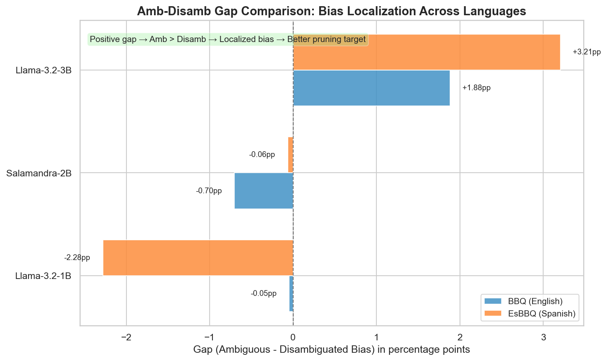

# Bias Evaluation Results

Baseline bias measurements for unpruned models using BBQ (English) and EsBBQ (Spanish) benchmarks.

**Evaluation Framework:** lm-evaluation-harness  
**Task Configuration:** 0-shot  
**Evaluation Dates:** BBQ (Dec 7, 2025), EsBBQ (Feb 20-22, 2026)

## Models Evaluated

| Model | Parameters | BBQ Status | EsBBQ Status |
|-------|-----------|------------|--------------|
| BSC-LT/salamandra-2b | 2B | ✅ Complete | ✅ Complete |
| meta-llama/Llama-3.2-1B | 1B | ✅ Complete | ✅ Complete |
| meta-llama/Llama-3.2-3B | 3B | ✅ Complete | ✅ Complete |

---

## BBQ Baseline Results (English)

### Overall Performance

| Model | Overall Acc | Amb Acc | Disamb Acc | Amb-Disamb Gap |
|-------|-------------|---------|------------|----------------|
| Salamandra-2b | 29.05% | 7.66% | 50.45% | -42.79pp |
| Llama-3.2-1B | 31.15% | 10.01% | 52.28% | -42.27pp |
| Llama-3.2-3B | 40.52% | 7.51% | 73.54% | -66.03pp |

### Aggregate Bias Scores

| Model | Ambiguous Bias | Disambiguated Bias | Ratio (Amb/Disamb) |
|-------|----------------|--------------------|--------------------|
| Salamandra-2b | 2.07% | 2.77% | 0.75 |
| Llama-3.2-1B | 1.70% | 1.75% | 0.97 |
| Llama-3.2-3B | 4.12% | 2.24% | 1.84 |

*Overall bias pattern comparison showing ambiguous vs disambiguated bias scores across BBQ (English) and EsBBQ (Spanish) benchmarks.*

### Top Bias Categories (Ambiguous Context)

| Category | Salamandra-2b | Llama-1B | Llama-3B |
|----------|---------------|----------|----------|
| Physical Appearance | 9.90% | 10.15% | 17.89% |
| Age | 2.72% | 7.50% | 16.30% |
| Gender Identity | 4.37% | 1.55% | 10.86% |

*Heatmap visualization of the top bias categories across models and benchmarks.*

---

## EsBBQ Baseline Results (Spanish)

### Overall Performance

| Model | Overall Acc | Amb Acc | Disamb Acc | Amb-Disamb Gap |
|-------|-------------|---------|------------|----------------|
| Salamandra-2b | 41.98% | 25.11% | 50.01% | -24.90pp |
| Llama-3.2-1B | 42.52% | 26.78% | 50.03% | -23.25pp |
| Llama-3.2-3B | 53.22% | 16.05% | 70.97% | -54.92pp |

### Aggregate Bias Scores

| Model | Ambiguous Bias | Disambiguated Bias | Ratio (Amb/Disamb) |
|-------|----------------|--------------------|--------------------|
| Salamandra-2b | 0.80% | 1.46% | 0.55 |
| Llama-3.2-1B | 0.29% | 1.25% | 0.23 |
| Llama-3.2-3B | 3.80% | 0.32% | 11.87 |

### Top Bias Categories (Ambiguous Context)

| Category Rank | Salamandra-2b | Llama-1B | Llama-3B |
|---------------|---------------|----------|----------|
| **1st** | SES (4.35%) | Disability Status (2.91%) | Physical Appearance (10.37%) |
| **2nd** | Nationality (4.17%) | SES (2.61%) | Gender (8.51%) |
| **3rd** | Race/Ethnicity (2.69%) | Age (1.47%) | Spanish Region (6.48%) |

**Note:** "Spanish Region" is a category unique to EsBBQ that reflects localized social biases.

---

## Cross-Lingual Observations

### Performance Shifts

All models show higher overall accuracy on EsBBQ (Spanish) compared to BBQ (English):
- **Salamandra-2b:** +12.93pp (29.05% → 41.98%)
- **Llama-3.2-1B:** +11.37pp (31.15% → 42.52%)
- **Llama-3.2-3B:** +12.70pp (40.52% → 53.22%)

### Ambiguous Context Accuracy

All models perform substantially better in ambiguous Spanish contexts than in English, signaling either better default handling of unknowns or differences in dataset translation:
- **Salamandra-2b:** +17.45pp (7.66% → 25.11%)
- **Llama-3.2-1B:** +16.77pp (10.01% → 26.78%)
- **Llama-3.2-3B:** +8.54pp (7.51% → 16.05%)

### Bias Pattern Consistency

**Llama-3.2-3B** maintains similar bias patterns across languages (higher bias in ambiguity):
- BBQ: Ambiguous bias (4.12%) > Disambiguated bias (2.24%)
- EsBBQ: Ambiguous bias (3.80%) > Disambiguated bias (0.32%)
- Ratio shift: 1.84 → 11.87

**Llama-3.2-1B** shows a more muted, inverted pattern in Spanish:
- BBQ: Ambiguous bias (1.70%) ≈ Disambiguated bias (1.75%)
- EsBBQ: Ambiguous bias (0.29%) < Disambiguated bias (1.25%)
- Ratio shift: 0.97 → 0.23

**Salamandra-2b** maintains a balanced pattern with lower magnitude in Spanish:
- BBQ: Ambiguous bias (2.07%) < Disambiguated bias (2.77%)
- EsBBQ: Ambiguous bias (0.80%) < Disambiguated bias (1.46%)
- Ratio: 0.75 → 0.55

*Amb-Disamb gap comparison showing bias localization across languages. Larger gaps indicate more concentrated bias patterns suitable for targeted pruning.*

### Category-Level Consistency

**Physical Appearance** ranks among the top bias categories in both languages for Llama-3.2-3B:
- BBQ: Ambiguous 17.89%, Disambiguated 9.02%
- EsBBQ: Ambiguous 10.37%, Disambiguated 6.04%

**Age** shows high bias in English (BBQ) but drops significantly in Spanish (EsBBQ) for Llama-3.2-3B:
- BBQ: Ambiguous 16.30%, Disambiguated 8.48%
- EsBBQ: Ambiguous 5.96%, Disambiguated 6.27%

**Gender/Gender Identity** bias increases with model scale in both languages:
- BBQ: Llama-1B (Amb 1.55%, Disamb 1.97%) → Llama-3B (Amb 10.86%, Disamb 8.04%)
- EsBBQ: Llama-1B (Amb 0.27%, Disamb 1.50%) → Llama-3B (Amb 8.51%, Disamb 4.03%)

**SES (Socioeconomic Status)** shows opposite scaling trends between languages:
- BBQ: Llama-1B (Amb 3.70%, Disamb 4.52%) → Llama-3B (Amb 1.37%, Disamb 0.17%)
- EsBBQ: Llama-1B (Amb 2.61%, Disamb 6.54%) → Llama-3B (Amb 5.43%, Disamb -1.09%)

---

## Data Files

**BBQ (English):**
- `base_models_bbq_results_latest.csv` / `.json`

**EsBBQ (Spanish):**
- `base_models_mbbq_results_latest.csv` / `.json`
